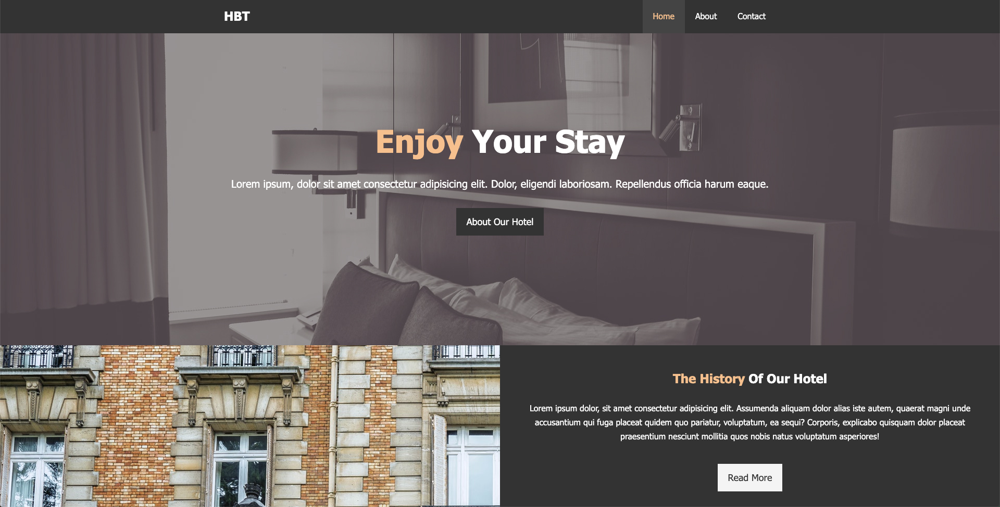
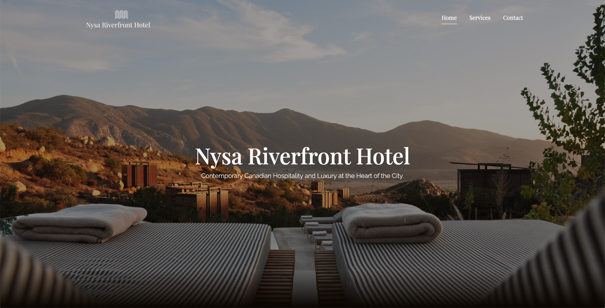

# Nysa-Riverfront-Hotel
This repository is home to a project I'm undertaking as a component of Brad Traversy's Modern HTML and CSS From The Beginning Udemy course. My project slightly deviates from that of Brad's as I've implemented a different design, a different HTML and CSS structure, and I've also added a few elements that weren't in his tutorial to make this project more personalized. The concepts that he goes over at this point in the series are preserved; I merely modified them into ways I thought were interesting and that I could actually do given my skillset.

Positions and floats are the primary ways to layout the entire website. The course covers flexbox and CSS grid but for now, this is all I can work with as I am yet to learn these concepts.

These are taken from the homepages of Brad's hotel BT website and my own take on this project. He is incredibley knowledgable in his craft and I've learned a lot from him even though I'm not even halfway in the course.

